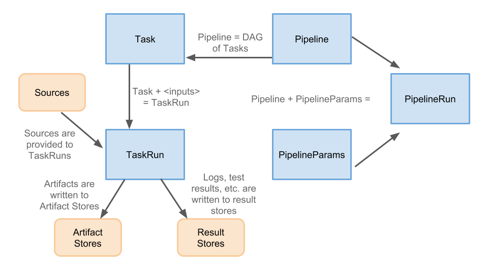

# Pipeline CRD

This repo contains the API definition of the Pipeline CRD and an on cluster implementation of that API.
The goal of the Pipeline CRD is to provide k8s-style resources that allow the
declaration of CI/CD-style pipelines, which can be backed by any arbitrary implementation.

Features the Pipeline CRD will support include:

* Conditional, parallel and distributed execution
* Interaction with CI/CD resources such as source code, artifacts, resutls, deployments and clusters

The goal of the Pipeline CRD is to fit into and cooperate with
[the Knative ecosystem](https://github.com/knative/docs#welcome-knative), specifically:

* [The Build CRD](https://github.com/knative/docs/blob/master/build/builds.md)
* [The Eventing APIs](https://github.com/knative/eventing/tree/master/docs/spec)

_See [examples](./examples) for some examples of how this is intended to work._

The CRDs involved are:

* [Task](#task)
* [Pipeline](#pipeline)
* [PipelineParams](#pipelineparams)
* [TaskRun](#taskrun)
* [PipelineRun](#pipelinerun)
* [Resources](#resources)

High level details of this design:

* [Pipelines](#pipelines) do not know what will trigger them, they can be
   triggered by events or by manually creating [PipelineRuns](#pipelinerun)
* [Tasks](#tasks) can exist and be invoked completely independently of
  [pipelines](#pipelines); they are highly cohesive and loosely coupled
* Test results are a first class concept, being able to navigate test results
  easily is powerful (e.g. see failures easily, dig into logs, e.g. like
  [the Jenkins test analyzer plugin](https://wiki.jenkins.io/display/JENKINS/Test+Results+Analyzer+Plugin))
* [Tasks](#tasks) can depend on artifacts, output and parameters created by other tasks.
* [Resources](#resources) are the artifacts used as inputs and outputs of TaskRuns.

## Task

`Task` is a CRD that knows how to instantiate a [Knative Build](https://github.com/knative/build),
either from a series of `steps` (i.e. [Builders](https://github.com/knative/docs/blob/master/build/builder-contract.md))
or from a [`BuildTemplate`](https://github.com/knative/docs/blob/master/build/build-templates.md).
It takes Knative Build and adds inputs and outputs. Where these inputs and outputs are provided
from is not known to a task, so they can be provided by a Pipeline or by a user invoking a Task directly.

`Tasks` are basically [Knative BuildTemplates](https://github.com/knative/build-templates)
with additional input types and clearly defined outputs.

## Pipeline

`Pipeline` describes a graph of [Tasks](#task) to execute. It defines the DAG
and expresses how all inputs (including [PipelineParams](#pipelineparams) and outputs
from previous `Tasks`) feed into each `Task`.

Dependencies between parameters or inputs/outputs are expressed as references to k8s objects.

## PipelineParams

`PipelineParams` contains parameters for a [Pipeline](#pipeline). One `Pipeline`
can be invoked with many different instances of `PipelineParams`, which can allow
for scenarios such as running against PRs and against a user’s personal setup.
`PipelineParams` can control:

* Which **serviceAccount** to use (provided to all tasks)
* Where **results** are stored (e.g. in GCS)

## TaskRun

Creating a `TaskRun` will invoke a [Task](#task), running all of the steps until completion
or failure. Creating a `TaskRun` will require satisfying all of the input requirements of the
`Task`.

`TaskRuns` are basically [Knative Builds](https://github.com/knative/build) with inputs and
outputs, and in the future we may want to transition `Builds` to become `Tasks`.

`TaskRuns` can be created directly by a user or by a [PipelineRun](#pipelinerun).

### TaskRun Status

Once a `TaskRun` has been created, it will start excuting its steps
sequentially. The `conditions` field will be updated as the `TaskRun`
executes:

* The `Started` condition will be added when the first step starts.
* The `Completed` condition will be added when the last step completes,
  or after a non-zero exit code from a step.
* The `Successful` condition will be added after the `Completed`
  condition and will indicate if the run succeeded or failed.

When the `TaskRun` has completed, the `steps` field will indicate
the exit code of all steps that completed.

## PipelineRun

Creating a `PipelineRun` executes the pipeline, creating [TaskRuns](#taskrun) for each task
in the pipeline.

`PipelineRuns` tie together a [Pipeline](#pipeline) and a [PipelineParam](#pipelineparam).
A `PipelineRun` could be created:

* By a user manually
* In response to an event (e.g. in response to a Github event, possibly processed via
  [Knative eventing](https://github.com/knative/eventing))

### PipelineRun Status

Once a `PipelineRun` has been created, it will start excuting the DAG
of its Tasks by creating a [`TaskRun`](#taskrun) for each of them. The
`conditions` field will be updated as the `PipelineRun`
executes:

* The `Started` condition will be added when the first `TaskRun` is created.
* The `Completed` condition will be added when the last `TaskRun`
completes (or fails).
* The `Successful` condition will be added after the `Completed`
  condition and will indicate if the `PipelineRun` succeeded or failed.

When the `PipelineRun` has completed, the `taskRuns` field will contain
references to all `TaskRuns` which were executed and their next and
previous `TaskRuns`.

### Resources

`Resources` in a pipelines are the set of objects that are going to be used 
as inputs and outputs of a `TaskRun`. 

* `Resources` is created directly in a pipeline configuration and bound 
to `TaskRun` as an input and/or output source. 
* The (optional) `passedConstraint` key on an `input source` defines a set of previous task names.
* When the `passedConstraint` key is specified on an input source, only the version of 
the resource that passed through the defined list of tasks is used.
* The `passedConstraint` allows for `Tasks` to fan in and fan out, and ordering can be expressed explicitly 
using this key since a task needing a resource from a another task would have to run after.