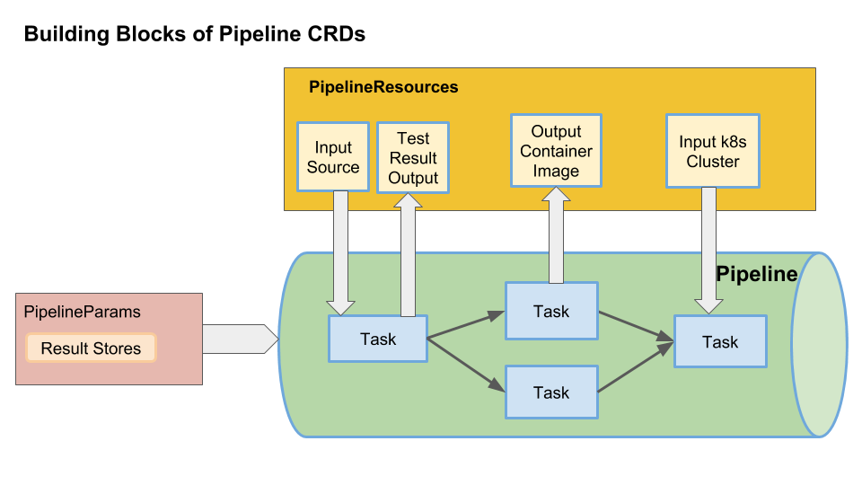

# Pipeline CRDs
Pipeline CRDs is an open source implementation to configure and run CI/CD style pipelines for your kubernetes application.

Pipeline CRDs creates [Custom Resources](https://kubernetes.io/docs/concepts/extend-kubernetes/api-extension/custom-resources/) as building blocks to declare pipelines.

A custom resource is an extension of Kubernetes API which can create a custom [Kubernetes Object](https://kubernetes.io/docs/concepts/overview/working-with-objects/kubernetes-objects/#understanding-kubernetes-objects).
Once a custom resource is installed, users can create and access its objects with kubectl, just as they do for built-in resources like pods, deployments etc.
These resources run on-cluster and are implemeted by [Kubernetes Custom Resource Definition (CRD)](https://kubernetes.io/docs/concepts/extend-kubernetes/api-extension/custom-resources/#customresourcedefinitions).

High level details of this design:

* [Pipelines](#pipeline) do not know what will trigger them, they can be
   triggered by events or by manually creating [PipelineRuns](#pipelinerun)
* [Tasks](#task) can exist and be invoked completely independently of
  [pipelines](#pipeline); they are highly cohesive and loosely coupled
* Test results are a first class concept, being able to navigate test results
  easily is powerful (e.g. see failures easily, dig into logs, e.g. like
  [the Jenkins test analyzer plugin](https://wiki.jenkins.io/display/JENKINS/Test+Results+Analyzer+Plugin))
* [Tasks](#task) can depend on artifacts, output and parameters created by other tasks.
* [Resources](#pipelineresources) are the artifacts used as inputs and outputs of TaskRuns.

## Building Blocks of Pipeline CRDs
Below diagram lists the main custom resources created by Pipeline CRDs:

* [Task](#task)
* [Pipeline](#pipeline)
* [PipelineParams](#pipelineparams)
* [Runs](#runs)
* [PipelineResources](#pipelineresources)



### Task

A Task is a collection of sequential steps you would want to run as part of your continous integration flow.

A task will run inside a container on your cluster. A Task declares:

1. Inputs the task needs.
1. Outputs the task will produce.
1. Sequence of steps to execute. Each step is [a container image](./using.md#image-contract).

Here is an example simple Task definition which echoes "hello world". The `hello-world` task does not define any inputs or outputs.

It only has one step named `echo`. The step uses the builder image `busybox` whose entrypoint set to `\bin\sh`.

```shell
apiVersion: pipeline.knative.dev/v1alpha1
kind: Task
metadata:
  name: hello-world
  namespace: default
spec:
  buildSpec:
    steps:
      - name: echo
        image: busybox
        command:
          - echo
        args:
          - "hello world!"
```

Examples of `Task` definitions with inputs and outputs are [here](../examples)

### Step Entrypoint

To get the logs out of a [step](#task), we provide our own executable that wraps
the `command` and `args` values specified in the `step`. This means that every
`Task` must use `command`, and cannot rely on the image's `entrypoint`.

### Configure Entrypoint image

To run a step needs to pull an `Entrypoint` image. Maybe the image is hard to pull
in your environment, so we provide a way for you to configure that by edit the `image`'s
value in a configmap named [`config-entrypoint`](./../config/config-entrypoint.yaml).

### Pipeline

`Pipelines` describes a graph of [Tasks](#Task) to execute.

Below, is a simple pipeline which runs `hello-world-task` twice one after the other.

In this `echo-hello-twice` pipeline, there are two named tasks; `hello-world-first` and `hello-world-again`.

Both the tasks, refer to [`Task`](#Task) `hello-world` mentioned in `taskRef` config.

```shell
apiVersion: pipeline.knative.dev/v1alpha1
kind: Pipeline
metadata:
  name: echo-hello-twice
  namespace: default
spec:
  tasks:
    - name: hello-world-first
      taskRef:
        name: hello-world
    - name: hello-world-again
      taskRef:
        name: hello-world
```

Examples of pipelines with complex DAGs are [here](../examples/pipelines)

### PipelineResources

`PipelinesResources` in a pipeline are the set of objects that are going to be used as inputs to a [`Task`](#Task) and can be output of [`Task`](#Task) .

For example:
* A task's input could be a github source which contains your application code.
* A task's output can be your application container image which can be then deployed in a cluster.

Read more on PipelineResources and their types [here](./using.md)

`Resources` in a pipelines are the set of objects that are going to be used 
as inputs and outputs of a `TaskRun`. 

### PipelineParams

`PipelineParams` contains parameters for a [Pipeline](#pipeline). One `Pipeline`
can be invoked with many different instances of `PipelineParams`, which can allow
for scenarios such as running against PRs and against a user’s personal setup.
`PipelineParams` can control:

* Which **serviceAccount** to use (provided to all tasks)
* Where **results** are stored (e.g. in GCS)
* What **clusters** you want to deploy to

For example:

```yaml
apiVersion: pipeline.knative.dev/v1alpha1
kind: PipelineParams
metadata:
  name: pipelineparams-sample
  namespace: default
spec:
    serviceAccount: 'demoServiceAccount'
    clusters:
        - name: 'testCluster'
          type: 'gke'
          endpoint: 'https://prod.gke.corp.com'
        - name: 'stagingCluster'
          type: 'gke'
          endpoint: 'https://staging.gke.corp.com'
    results:
        runs:
          type: 'gcs'
          url: 'gcs://somebucket/results/runs'
        logs:
          type: 'gcs'
          url: 'gcs://somebucket/results/logs'
        tests:
          type: 'gcs'
          url: 'gcs://somebucket/results/tests'
```

### Runs

To invoke a [`Pipeline`](#pipeline) or a [`Task`](#task), you must create a corresponding
`Run`:

* [TaskRun](#taskrun)
* [PipelineRun](#pipelinerun)

#### TaskRun

Creating a `TaskRun` will invoke a [Task](#task), running all of the steps until 
completion or failure. Creating a `TaskRun` will require satisfying all of the input
requirements of the `Task`.

`TaskRuns` can be created directly by a user or by a [PipelineRun](#pipelinerun).

#### PipelineRun

Creating a `PipelineRun` executes the pipeline, creating [TaskRuns](#taskrun) for each 
task in the pipeline.

`PipelineRuns` tie together a [Pipeline](#pipeline) and a [PipelineParam](#pipelineparams).

A `PipelineRun` could be created:

* By a user manually
* In response to an event (e.g. in response to a Github event, possibly processed via
  [Knative eventing](https://github.com/knative/eventing))
