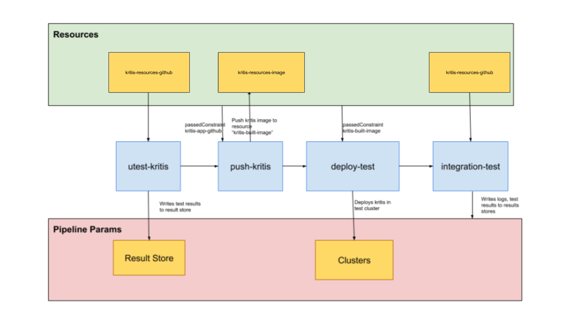
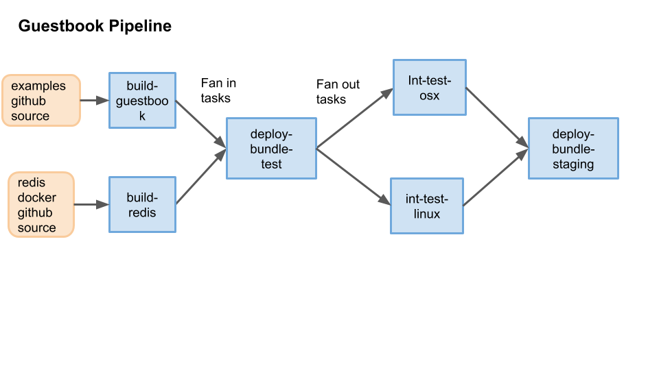

# Examples

This directory contains examples of [the Pipeline CRDs](../README.md) in action.

To deploy them to your cluster (after
[installing the CRDs and running the controller](../DEVELOPMENT.md#installing-andrunning)):

```bash
kubectl apply -f examples/pipelines
kubectl apply -f examples/
kubectl apply -f examples/invocations
```

## Example Pipelines

We have 2 example [Pipelines](../README.md#pipeline) in [./pipelines](./pipelines)

1. [The Kritis Pipline](./pipelines/kritis.yaml): This example builds a Pipeline for the
   [kritis project](https://github.com/grafeas/kritis), and demonstrates how to configure
    a pipeline which:

    1. Runs unit tests
    2. Build an image
    3. Deploys it to a test environment
    4. Runs integration tests

   

2. [Guestbook](./pipelines/guestbook.yaml): This Pipeline is based on example application in
   [the Kubernetes example Repo](https://github.com/kubernetes/examples/tree/master/guestbook)
   This pipeline demonstartes how to integrate frontend
   [guestbook app code](https://github.com/kubernetes/examples/tree/master/guestbook-go) with
   backend [redis-docker image](https://github.com/GoogleCloudPlatform/redis-docker/tree/master/4) provided by GCP.

   

## Example Tasks

* Example [Tasks](../../README.md#task) are in:
  * [build_task.yaml](build_task.yaml)
  * [deploy_tasks.yaml](deploy_tasks.yaml)
  * [test_tasks.yaml](test_tasks.yaml)

Here are the Task Types that are defined.

1. `build-push`: This task as the name suggests build an image via [kaniko](https://github.com/GoogleContainerTools/kaniko) and pushes it to registry.
2. `make`:  Runs make target.
3. `integration-test-in-docker`: This is a new task that is used in the sample pipelines to test an app in using `docker build` command to build an image with has the integration test code.
This task then calls `docker run` which will run the test code. This follows the steps we have for [kritis integration test](https://github.com/grafeas/kritis/blob/4f83f99ca58751c28c0ec40016ed0bba5867d70f/Makefile#L152)
4. `deploy-with-helm`: This task deploys a kubernetes app with helm.
5. `deploy-with-kubectl`: This task deploys with kubectl apply -f <filename>

### Example Runs

The [runs](./runs/) dir contains an example [TaskRun](../README.md#taskrun) and an example [PipelineRun](../README.md#pipelinerun).

[run-kritis-test.yaml](./invocations/run-kritis-test.yaml) shows an example of how to manually run kritis unit test off your development branch.

[kritis-pipeline-run.yaml](./invocations/kritis-pipeline-run.yaml) shows an example of
what it would look like to invoke the [kritis example pipeline](#example-pipelines)
manually. In the `conditions` field for type `Successful` you can see that the status
is `False`, which indicates that the Pipeline was not run successfully. The field
`message` contains a human readable error indicating that one of the `TaskRuns` failed.
This `condition` (and everything else in the `status` section) would be populated by the
controller as it realized the PipelineRun (i.e. ran the Pipeline).
